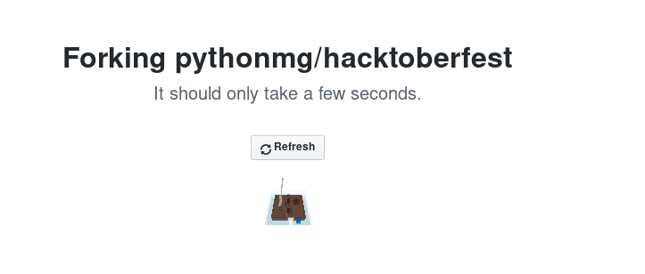
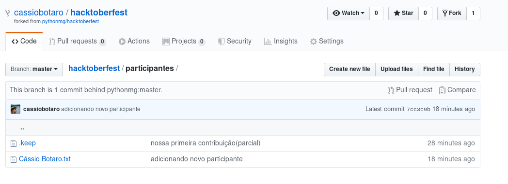
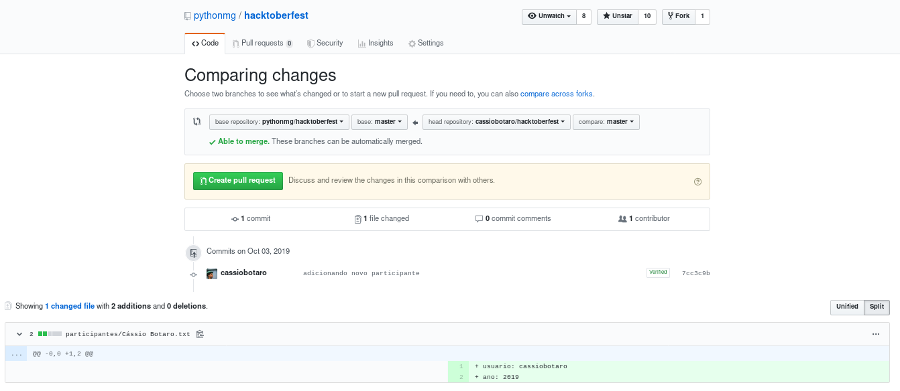
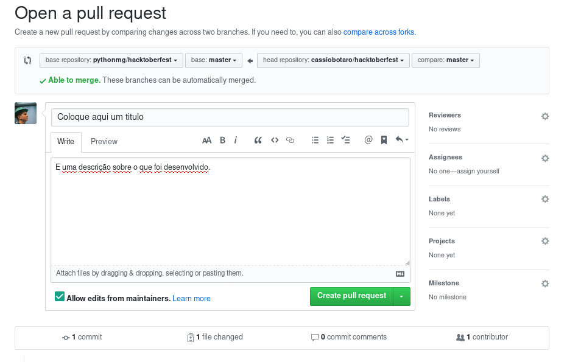

# :package: Nossa primeira contribuição.

Serão necessárias 4 contribuições para ganhar uma camisa exclusiva, nós vamos te ajudar a realizar uma delas te ensinando a como contribuir com projetos open source e ao mesmo tempo você irá contribuir com pessoas procurando projetos para contribuir.

Esperamos que isto sirva de incentivo para continuar contribuindo mesmo depois de já ter ganho a camisa.

O primeiro passo é instalação da ferramenta `git`.

Siga os passos de acordo com o seu sistema operacional e tenha certeza de que a ferramenta está instalada e funcionando antes de prosseguir.

### :octocat: Git

**O que é?**

[Git](https://git-scm.com/) é um controle de versão livre e de código aberto, construido para lidar com projetos pequenos e grandes de maneira rápida e eficiente.

**Para que serve?**

Com certeza você já escreveu um arquivo, mais tarde troca algumas coisas e salva como final. Mais tarde ou no outro dia você decide fazer mais mudanças e chama de "agoravai" e quando menos percebe já tem um monte de arquivos e talvez nem se lembre mais qual a última versão.

É para gerenciar alterações feitas no projeto durante o tempo que serve esta ferramenta.

Durante o guia vamos salvando as alterações feitas sem precisar de ter várias cópias do mesmo arquivo.

**Como instalar**

:computer: *windows*

Para usuários windows, baixe a última versão neste [site](https://git-scm.com://git-scm.com/). Deixe as opções já marcadas por padrão, exceto a mostrada abaixo que deve ser ajustada.


:package: *ubuntu*

O pacote git se encontra na central de programas.

`sudo apt install git`

**Vamos verificar se deu tudo certo?**

:computer: *windows*

Clique no botão iniciar, digite `cmd` e abra o programa `prompt de comandos`. Agora digite `git --version`.

:package: *ubuntu*

Abra um terminal e digite `git --version`.

A saída para ambos os sistemas operacionais deverá ser:

```bash
$ git --version
git version 2.19.0
```

## Criando uma cópia do repositório

Com as ferramentas prontas, vamos contribuir com o primeiro projeto.

Mas como escolher um projeto? Como saber como eu devo proceder e quais as exigências do projeto?

Guarde estas dúvidas, pois serão respondidas até o final, por enquanto, para aprender os passos de como contribuir, vamos iniciar contribuindo com este guia.

Já estamos com o repositório aberto e estamos vendo os arquivos e diretórios contidos nele.

Vamos começar fazendo um "*fork*" do repositório original.

Isto é necessário pois normalmente não temos permissões de alteração do repositório ao qual estamos contribuindo.

Abra em uma outra aba o [repositório](http://github.com/pythonmg/hacktoberfest).


Clique no botão "fork" que aparece no canto superior direito.


Aguarde enquanto a cópia será feita.



Quando terminar você será redirecionado para a cópia do repositório que agora está na sua conta.


Repare que abaixo do nome do repositório ele indica que aquele repositório é um "*fork*" de outro.

## Modificando os arquivos

Agora temos uma cópia nosso do projeto original, vamos modificá-la, acrescentando nosso nome na lista de participantes da hacktoberfest.

A nossa cópia está apenas em nossa conta do github, precisamos trazê-la para nosso computador.

Vamos fazer um "*clone*" do nosso repositório.

:warning: Não esqueça de substituir `<seuusuario>` pelo seu nome de usuário no github

:computer: *windows*

Clique no botão iniciar, digite `cmd` e abra o programa `prompt de comandos`.

Navegue até o diretório que deseja trabalhar por exemplo `C:\Usuários\Cassio`.

:point_right: Uma dica, para navegar entre diretórios utilize o comando `cd`.

Agora digite `git clone https://github.com/<seuusuario>/hacktoberfest.git`.

:package: *ubuntu*

```bash
$ cd ~
$ git clone https://github.com/<seuusuario>/hacktoberfest.git
Cloning into 'hacktoberfest'...
remote: Enumerating objects: 14, done.
remote: Counting objects: 100% (14/14), done.
remote: Compressing objects: 100% (14/14), done.
remote: Total 14 (delta 1), reused 8 (delta 0), pack-reused 0
Unpacking objects: 100% (14/14), done.
```

Agora vamos até o diretório onde está, mas não feche a tela preta, pois já voltamos pra ela.


Crie um novo arquivo com seu nome e sobrenome no diretório `participantes`.

Exemplo: Cássio Botaro.txt

O conteúdo deste arquivo será seu usuário do github e o ano que participou.

Exemplo:
```
usuário: cassiobotaro
ano: 2019
```


Terminamos de modificar o projeto, vamos agora salvar as alterações feitas.


## Salvando as alterações feitas

Com o nosso nome já entre os participantes vamos salvar as alterações que fizemos e enviar de volta para o servidor (github).

De volta a tela preta, vamos utilizar o comando `git status` para checar o que foi feito até agora.

```bash
$ git status
On branch master
Your branch is up-to-date with 'origin/master'.

Untracked files:
  (use "git add <file>..." to include in what will be committed)

    participantes/Cássio Botaro.txt

nothing added to commit but untracked files present (use "git add" to track)
```

Vemos que nosso arquivo criado não está rastreado, precisamos então avisar ao controle de versão (git) que monitore este arquivo.

`$ git add participantes/Cássio \Botaro.txt`

:floppy_disk: Agora vamos marcar esta versão como salva. Se estivessemos em um jogo de video game é como se estivessemos salvando nosso progresso no jogo.

`git commit -m "adicionando novo participante"`

:up: Por fim, envie ao github a versão atualizada do projeto.

`git push`



## Pedindo a junção dos códigos

Agora é a hora de pedirmos ao repositório que estamos contribuindo a junção das nossas alterações ao repositório original.

Clique no botão "*pull request*".


Uma página comparando suas alterações com o repositório original será aberta.



Clique no botão verde "*Create pull request*".

Na Nova tela que irá se abrir, coloque um título das modificações que foram feitas.



E uma descrição detalhada. Será necessário apertar mais uma vez no botão verde para concluir o processo.


## Parabéns

Meus parabéns! Você realizou sua primeira contribuição em algum projeto open source.

Volte na sua página de [perfil da hacktoberfest](https://hacktoberfest.digitalocean.com/profile) e veja que sua barra de progresso aumentou.


Espero que seja a primeira de muitas.

Vamos agora explorar todo o mundo do open source!

[Procurando mais projetos para contribuir! :arrow_right:](procurando.md)

[:arrow_left: Como participar?](como-participar.md)

[:leftwards_arrow_with_hook: Voltar ao README ](README.md)
